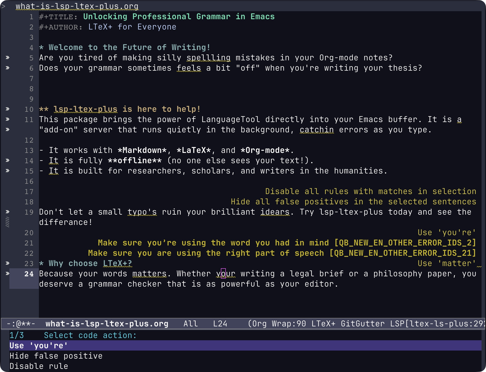

# Emacs LTeX+

`lsp-ltex-plus` is a lightweight [lsp-mode](https://github.com/emacs-lsp/lsp-mode) client for **LTeX+**, a powerful grammar and spell checker powered by [LanguageTool](https://languagetool.org/).

This package allows you to have professional-grade grammar checking in Emacs while you write Markdown, LaTeX, Org-mode, and more. It is designed to be an "add-on" server, meaning it runs quietly in the background alongside your existing programming language servers.


*LTeX+ in action: `C-c l a a` activates the LSP actions, allowing you to choose the suitable correction (e.g., fixing "your" to "you're" in the example above). The key binding can be customized by configuring the `lsp-mode` package.*

For detailed information about the underlying LTeX+ server and its capabilities, please refer to the [official LTeX+ documentation](https://ltex-plus.github.io/ltex-plus/index.html).

## New to Emacs or LSP?

If you use Emacs for writing—perhaps in the humanities, social sciences, or law—rather than for programming, the term "LSP" might be new to you. Here is a simple way to understand how this works:

*   **The LSP Server (LTeX+):** This is a separate program that runs in the background on your computer. It "reads" your document as you type and identifies errors, much like the grammar checkers in Microsoft Word or Google Docs.
*   **The Bridge (lsp-mode):** This is a popular Emacs package that manages the connection between Emacs and these background programs.
*   **The Client (lsp-ltex-plus):** This is the package you are looking at right now. It acts as the specific "translator" that tells Emacs exactly how to interact with the LTeX+ grammar server.

While this technology was originally built for programmers to find "bugs" in their code, we use it here to provide a powerful, professional-grade assistant for your writing.

## Offline Privacy vs. Online Power

LTeX+ can operate in two distinct ways, depending on your needs:

1.  **Fully Offline (Default):** By default (or by setting `lsp-ltex-plus-lt-server-uri` to `nil`), the grammar checker runs entirely on your local machine. No text ever leaves your computer, making it ideal for sensitive work or when you don't have internet access.
2.  **Remote API:** You can connect to a remote LanguageTool server (like `https://api.languagetoolplus.com`) by setting the `lsp-ltex-plus-lt-server-uri` variable. This can offload the processing from your computer.

**Note on Premium Subscriptions:** If you have a paid LanguageTool Premium account, you can provide your credentials via `lsp-ltex-plus-lt-username` and `lsp-ltex-plus-lt-api-key`. While this provides access to some additional rules, many users find that the local/standard experience is already excellent and hard to distinguish from the premium service.

## Features

- **Concurrent Execution:** Works simultaneously with other LSP servers (like `texlab` for LaTeX or `pyright` for Python).
- **Smart Persistence:** Words you "add to dictionary" or rules you disable are automatically saved to your Emacs directory and remembered across sessions.
- **Bi-directional Support:** Handles advanced server requests (like dynamic configuration fetching) safely.
- **Highly Configurable:** Easily switch languages, enable "picky" grammar rules, or connect to a premium LanguageTool account.
- **Wide Language Support:** Pre-configured for Markdown, LaTeX, Org, RestructuredText, HTML, BibTeX, and many others.

## Prerequisites

Before using this package, you need:

1.  **LTeX+ Language Server:** This is the core engine that performs the grammar checks. See [Server Installation](#server-installation) below.
2.  **Java:** LTeX+ requires **Java 21** or higher. Most platform-specific releases of LTeX+ include a bundled Java runtime, so you don't necessarily need to install it separately. See [Java Runtime Configuration](#3-java-runtime-configuration) for details.
3.  **Emacs lsp-mode:** This package is an extension for `lsp-mode` (version 6.0 or higher). Therefore, `lsp-mode` must be installed and available before `lsp-ltex-plus` can function.

## Server Installation

The LTeX+ language server is a standalone program. You can install it anywhere on your computer that suits your workflow.

### 1. Download the Server

Download the latest release for your architecture from the [official GitHub releases page](https://github.com/ltex-plus/ltex-ls-plus/releases/latest). 

Choose the file that matches your operating system and CPU architecture:

- **Linux:** `ltex-ls-plus-X.Y.Z-linux-x64.tar.gz` or `ltex-ls-plus-X.Y.Z-linux-aarch64.tar.gz`
- **macOS:** `ltex-ls-plus-X.Y.Z-mac-x64.tar.gz` or `ltex-ls-plus-X.Y.Z-mac-aarch64.tar.gz` (Apple Silicon)
- **Windows:** `ltex-ls-plus-X.Y.Z-windows-x64.zip` or `ltex-ls-plus-X.Y.Z-windows-aarch64.zip`

### 2. Choose an Installation Directory

A common, Emacs-idiomatic place to store such tools is within your `.emacs.d` directory (e.g., `~/.emacs.d/ltex-ls-plus/`). However, you can place it anywhere—for instance, in `/usr/local/bin/` or a dedicated software folder.

Once extracted, the package contains:
- `bin/ltex-ls-plus`: The main executable used by this package.
- `bin/ltex-cli-plus`: A command-line interface for LTeX+.
- `jdk-21.x.y/`: A bundled Java runtime.

### 3. Java Runtime Configuration

LTeX+ is a Java application. By default, the server uses the Java runtime bundled within its own directory. 

- **Recommendation:** Start with the bundled Java runtime. It is guaranteed to be compatible.
- **Using System Java:** If you already have Java 21+ installed and prefer to use it, you can delete the bundled `jdk-21.x.y/` folder. In this case, ensure your `JAVA_HOME` environment variable points to your system Java or explicitly set the path in Emacs:
  ```elisp
  (use-package lsp-ltex-plus
    :custom
    (lsp-ltex-plus-java-path "/path/to/your/java/home"))
  ```

### 4. Make it Discoverable

For `lsp-ltex-plus` to work, Emacs must be able to find the `ltex-ls-plus` binary. You have several options:

- **Symlink or Shim (Recommended):** To avoid cluttering your `PATH` with many individual directories, you can create a symlink or a small shim script in a directory that is already in your `PATH` (such as `~/.local/bin/` or `/usr/local/bin/`).
  
  Example (Linux/macOS symlink):
  ```bash
  ln -s /path/to/ltex-ls-plus/bin/ltex-ls-plus ~/.local/bin/ltex-ls-plus
  ```

  Example (Bash shim script):
  A shim is useful if you need to set environment variables like `JAVA_HOME` specifically for the server:
  ```bash
  #!/bin/bash
  # Save this as ~/.local/bin/ltex-ls-plus and make it executable
  export JAVA_HOME="/path/to/ltex-ls-plus/jdk-21.x.y"
  exec "/path/to/ltex-ls-plus/bin/ltex-ls-plus" "$@"
  ```

- **Direct Configuration:** If you prefer not to modify your system environment, you can point to the executable directly in your Emacs configuration:
  ```elisp
  (use-package lsp-ltex-plus
    :custom
    (lsp-ltex-plus-ls-plus-executable "/path/to/ltex-ls-plus/bin/ltex-ls-plus"))
  ```

- **Update PATH:** Alternatively, add the `bin/` directory of the extracted server to your system `PATH` (via your shell profile) or your Emacs `exec-path`.

## Installation (Emacs Package)

### Using straight.el

```elisp
(straight-use-package
 '(lsp-ltex-plus :type git :host github :repo "username/emacs-ltex-plus"))
```

### Manual Installation

Download `lsp-ltex-plus.el`, place it in your load path, and require it:

```elisp
(require 'lsp-ltex-plus)
```

## Basic Configuration

The most idiomatic way to use this package is to call `lsp-ltex-plus-install-hooks` in your `:init` block. It reads the default list of ~80 supported major modes and installs a lightweight hook for each one. The full package is loaded lazily — only when you first open a file whose major mode is on the list.

```elisp
(use-package lsp-ltex-plus
  :defer t
  :init
  (lsp-ltex-plus-install-hooks))
```

### Customizing Supported Modes

`lsp-ltex-plus-major-modes` is an alist of `(major-mode . language-id)` pairs. The `car` of each entry is a standard Emacs major mode symbol. The `cdr` is a **VS Code language identifier** — the same identifier used by the LSP specification and by LTeX+ internally to decide which documents to check. The canonical list of these identifiers is at the [VS Code language identifiers page](https://code.visualstudio.com/docs/languages/identifiers); extensions can define additional ones beyond that list.

To replace the default list entirely, set `lsp-ltex-plus-major-modes` in `:custom` (which runs before `:init`):

```elisp
(use-package lsp-ltex-plus
  :defer t
  :custom
  (lsp-ltex-plus-major-modes '((markdown-mode . "markdown")
                               (org-mode      . "org")
                               (text-mode     . "plaintext")))
  :init
  (lsp-ltex-plus-install-hooks))
```

To add or remove individual entries from the default list, call `lsp-ltex-plus-ensure-major-modes` **before** the `use-package` block. That call loads the bootstrap file and makes `lsp-ltex-plus-major-modes` available for editing:

```elisp
(lsp-ltex-plus-ensure-major-modes)
(setq lsp-ltex-plus-major-modes
      (assoc-delete-all 'python-mode lsp-ltex-plus-major-modes))

(use-package lsp-ltex-plus
  :defer t
  :init
  (lsp-ltex-plus-install-hooks))
```

### Ready-to-go Configuration Example

For a more robust setup using `use-package` and `straight.el`, you can use the following pattern. This example shows how to automatically pull credentials from your system environment variables if you choose to use an online service:

```elisp
(use-package lsp-ltex-plus
  :straight (lsp-ltex-plus
             :type git
             :host github
             :repo "username/emacs-ltex-plus")

  :defer t

  :custom
  ;; To use the online service, set the URI.
  ;; If you prefer the local-only server, you can omit this (it defaults to nil).
  (lsp-ltex-plus-lt-server-uri "https://api.languagetoolplus.com")

  :init
  ;; Install hooks for all supported major modes. The full package loads
  ;; lazily — only when you first open a relevant file.
  (lsp-ltex-plus-install-hooks)

  :config
  ;; Optional: Automatically use credentials from environment variables.
  ;; This is safer than hardcoding your API key in your configuration.
  (let ((user (getenv "LANGUAGETOOL_USERNAME"))
        (key  (getenv "LANGUAGETOOL_API_KEY")))
    (when (and user (or (null lsp-ltex-plus-lt-username) (string-empty-p lsp-ltex-plus-lt-username)))
      (setq lsp-ltex-plus-lt-username user))
    (when (and key (or (null lsp-ltex-plus-lt-api-key) (string-empty-p lsp-ltex-plus-lt-api-key)))
      (setq lsp-ltex-plus-lt-api-key key))))
```

### Key Settings
- `lsp-ltex-plus-language`: The language variant to check (e.g., `"en-US"`, `"de-DE"`).
- `lsp-ltex-plus-additional-rules-enable-picky-rules`: Set to `t` if you want stricter grammar checks (e.g., passive voice detection).
- `lsp-ltex-plus-apply-kind-first-patch`: Set to `t` to enable the protocol deadlock fix (defaults to `nil`). **Strongly recommended if you use a remote server** — see [Communication Stalls — No More Diagnostics](#communication-stalls--no-more-diagnostics) for details.

For the full list of available settings, see [Customization](#customization).

## Usage

Once active, LTeX+ works just like any other LSP server:

- **Diagnostics:** Errors and warnings will be highlighted in your buffer.
- **Code Actions:** Use your standard `lsp-execute-code-action` (usually `s-l a` or `C-c l a`) to:
    - Add a word to your personal dictionary.
    - Disable a specific rule you don't like.
    - Ignore a false positive.


## Customization

`lsp-ltex-plus` supports the full range of customizable parameters provided by the LTeX+ server, alongside unique settings specific to this Emacs client (such as debugging tools). For detailed documentation on the official LTeX+ server settings, visit the [official settings page](https://ltex-plus.github.io/ltex-plus/settings.html).

You can configure these using `:custom` in `use-package`:

```elisp
(use-package lsp-ltex-plus
  :custom
  ;; Client-specific: Enable detailed logging for troubleshooting
  (lsp-ltex-plus-debug t)
  ;; Server-specific: Provide a custom path to the LTeX+ root directory
  (lsp-ltex-plus-ltex-ls-path "~/path/to/ltex-ls-plus-18.6.1")
  ;; Server-specific: Set the language
  (lsp-ltex-plus-language "en-GB"))
```

<details>
<summary><b>Click to see the full list of supported parameters</b></summary>

| Parameter | Description | Official LTeX+ Setting |
| :--- | :--- | :---: |
| `lsp-ltex-plus-ls-plus-executable` | The name or path of the ltex-ls-plus executable. | |
| `lsp-ltex-plus-debug` | When non-nil, enable verbose logging and JSON-RPC tracing. | |
| `lsp-ltex-plus-major-modes` | Alist of (major-mode . language-id) pairs for lsp-ltex-plus activation. | |
| `lsp-ltex-plus-language` | The language (e.g., "en-US") LanguageTool should check against. | X |
| `lsp-ltex-plus-enabled-rules` | Lists of rules that should be enabled (language-specific). | X |
| `lsp-ltex-plus-disabled-rules` | Lists of rules that should be disabled (language-specific). | X |
| `lsp-ltex-plus-bibtex-fields` | List of BibTeX fields whose values are to be checked. | X |
| `lsp-ltex-plus-latex-commands` | List of LaTeX commands to be handled by the LaTeX parser. | X |
| `lsp-ltex-plus-latex-environments` | List of LaTeX environments to be handled by the LaTeX parser. | X |
| `lsp-ltex-plus-markdown-nodes` | List of Markdown node types to be handled by the Markdown parser. | X |
| `lsp-ltex-plus-additional-rules-enable-picky-rules` | Enable LanguageTool rules that are marked as picky. | X |
| `lsp-ltex-plus-additional-rules-mother-tongue` | Optional mother tongue of the user (e.g., "de-DE"). | X |
| `lsp-ltex-plus-additional-rules-language-model` | Optional path to a directory with n-gram language models. | X |
| `lsp-ltex-plus-lt-server-uri` | Base URI for the LanguageTool HTTP server (set to nil for local-only). | X |
| `lsp-ltex-plus-lt-username` | Username for LanguageTool Premium API access. | X |
| `lsp-ltex-plus-lt-api-key` | API key for LanguageTool Premium API access. | X |
| `lsp-ltex-plus-ltex-ls-path` | Path to the root directory of ltex-ls-plus. | X |
| `lsp-ltex-plus-ltex-ls-log-level` | Logging level of the ltex-ls-plus server log. | X |
| `lsp-ltex-plus-java-path` | Path to an existing Java installation (JAVA_HOME). | X |
| `lsp-ltex-plus-java-initial-heap` | Initial size of the Java heap memory (MB). | X |
| `lsp-ltex-plus-java-max-heap` | Maximum size of the Java heap memory (MB). | X |
| `lsp-ltex-plus-sentence-cache-size` | Size of the LanguageTool ResultCache in sentences. | X |
| `lsp-ltex-plus-completion-enabled` | Controls whether completion is enabled (IntelliSense). | X |
| `lsp-ltex-plus-diagnostic-severity` | Severity of the diagnostics (error, warning, information, hint). | X |
| `lsp-ltex-plus-check-frequency` | Controls when documents should be checked (edit, save, manual). | X |
| `lsp-ltex-plus-clear-diagnostics-when-closing-file` | Whether to clear diagnostics when a file is closed. | X |
| `lsp-ltex-plus-apply-kind-first-patch` | Whether to apply the 'Kind-First' routing patch to lsp-mode. | |

</details>

## Troubleshooting

All variables mentioned below are standard Emacs customization options. If you use `use-package`, it is recommended to set them within the `:custom` block of your configuration.

### Server Not Found

If Emacs cannot find the `ltex-ls-plus` binary, ensure it is in your system `PATH`. You can verify this within Emacs by evaluating:

```elisp
(executable-find "ltex-ls-plus")
```

If it returns `nil`, you must either add the binary's directory to your `PATH` or provide the absolute path to the executable via `lsp-ltex-plus-ls-plus-executable`. See [Server Installation](#4-make-it-discoverable) for details.

### Communication Stalls — No More Diagnostics

**Symptom:** After a few edits, grammar diagnostics stop updating entirely. The `*lsp-log*` buffer shows no new activity, and the server appears alive but silent.

**Cause:** This is a JSON-RPC ID collision deadlock. LTeX+ sends its own requests to Emacs (e.g., to fetch your configuration) while Emacs is still waiting for a response from the server. When the IDs of these two concurrent messages happen to collide, `lsp-mode`'s default parser misroutes the server's request as a response to a pending client request — causing both sides to wait for each other indefinitely.

This is most likely with a **remote/online server**, where both network latency and the server's own processing time (it is a shared service handling many requests) mean that responses take long enough for message overlaps to become virtually inevitable. It can also occur, though rarely, with the local server.

**Fix:** Enable the Kind-First protocol patch:

```elisp
(use-package lsp-ltex-plus
  :custom
  (lsp-ltex-plus-apply-kind-first-patch t))
```

This makes `lsp-mode` classify messages by their content (presence of a `"method"` field) rather than by ID alone, which is the correct approach per the JSON-RPC specification. See [Lsp-mode Protocol Patch](#lsp-mode-protocol-patch) for the full technical explanation.

### Server Crashes or Memory Issues

The LTeX+ server runs on the Java Virtual Machine (JVM) and can be memory-intensive. If the server crashes unexpectedly or becomes unresponsive, you may need to adjust its memory allocation.

You can control the Java heap size using these variables (values are in megabytes):

- `lsp-ltex-plus-java-initial-heap` (default: `64`): Corresponds to the `-Xms` Java option.
- `lsp-ltex-plus-java-max-heap` (default: `512`): Corresponds to the `-Xmx` Java option.

If you encounter crashes, try increasing the maximum heap size:

```elisp
(use-package lsp-ltex-plus
  :custom
  (lsp-ltex-plus-java-max-heap 1024))
```

While you can experiment with lower values to save system resources, be aware that setting the memory too low may result in an unstable server and frequent crashes. See [Java Runtime Configuration](#3-java-runtime-configuration) for more context.

## Under the Hood

This section is for users who want to understand how `lsp-ltex-plus` works internally — useful context if you hit an unexpected issue or simply want to know what is happening behind the scenes.

### Lsp-mode Protocol Patch

LTeX+ frequently initiates its own requests to Emacs (e.g., to fetch your configuration). In high-latency environments—such as when using a **remote server**—these server requests often overlap with Emacs's own requests to the server (like checking a document). 

Because a remote document check can take several hundred milliseconds to complete, there is a very high probability that the server will send a request while Emacs is still waiting for a response. In this scenario, a JSON-RPC "id collision" occurs: `lsp-mode`'s default parser misinterprets the server's new request as a response to its own pending check, causing both sides to hang indefinitely.

This package includes a protocol-level patch that ensures Emacs doesn't just trust request ID numbers (which can collide). Instead, it analyzes the message format to distinguish with certainty whether a message is a new request from the server or a response to a previous client request.

*   **When to use:** **Required** if you use a **remote/online server**. Without this patch, the connection **will** deadlock as soon as a server request overlaps with a pending document check.
*   **When to skip:** Usually not needed if you use the **local server**, as the near-instantaneous response time makes such overlaps extremely unlikely.
*   **Upstream Note:** I plan to submit this fix to `lsp-mode` so it can eventually be integrated into the core package. Because this is a protocol-level improvement, enabling it will generally improve the stability and reliability of **all** your other LSP clients as well.

To enable the patch, add this to your `:custom` block:

```elisp
(use-package lsp-ltex-plus
  :custom
  (lsp-ltex-plus-apply-kind-first-patch t))
```

### How does `lsp-ltex-plus-mode` get set up and activated?

The package is split into two files with different load-time profiles:

- **`lsp-ltex-plus-bootstrap.el`** — tiny, no dependencies. Loaded at `:init` time. Defines the major-mode alist and exposes two autoloaded entry points.
- **`lsp-ltex-plus.el`** — the full client. Loaded lazily, only when a relevant buffer is first opened.

#### Setup: what happens at startup

When the package manager builds `lsp-ltex-plus`, it scans both files for `;;;###autoload` cookies and writes a single autoloads file. This registers lightweight stubs for three symbols — `lsp-ltex-plus-ensure-major-modes`, `lsp-ltex-plus-install-hooks`, and `lsp-ltex-plus-mode` — very early at startup, before any `use-package` form is evaluated. Neither file is loaded yet.

When `use-package` evaluates the `:init` block and calls `(lsp-ltex-plus-install-hooks)`, it hits that stub, which loads `lsp-ltex-plus-bootstrap.el` (the tiny file only). The full package is **not** loaded. The function then adds `lsp-ltex-plus-mode` to each major-mode hook listed in `lsp-ltex-plus-major-modes`.

#### Activation: user opens a relevant file

```
User opens foo.md
  → markdown-mode activates → markdown-mode-hook fires
      → lsp-ltex-plus-mode called ← hits its autoload stub
          → lsp-ltex-plus.el loads for the first time
              → (require 'lsp-ltex-plus-bootstrap) → already loaded, no-op
              → (with-eval-after-load 'lsp-mode ...) registered
          → lsp-ltex-plus-mode body runs → (lsp) called
              → lsp-mode.el loads → (provide 'lsp-mode) fires
                  → lsp-ltex-plus--setup runs ← client registered
              → lsp-mode finds ltex-ls-plus, activates it
```

The crucial detail is that `with-eval-after-load` fires **synchronously inside the `require` call**, at the exact moment `lsp-mode.el` evaluates `(provide 'lsp-mode)`. By the time `(lsp)` returns, the client is already registered. There is no race condition.

Thus, with `with-eval-after-load`, we ensure the correct load orders, while no special configuration is required from the user.

## Why this package?

Previously, the only available option was [lsp-ltex](https://github.com/emacs-languagetool/lsp-ltex). However, that package had not been updated to support the newer **plus** version of the server (`ltex-ls-plus`), and it suffered from persistent instability—at least on my setup using Emacs 31.0.50.

More importantly, I simply could not get the original package to run reliably; in fact, it rarely managed more than a few corrections before the communication with the server crashed. I spent numerous hours trying to diagnose the issue, but I couldn't find a fix. While it might work fine for others on different versions of Emacs, I found it impossible to maintain a stable workflow where the spell checker could survive more than a few edits.

To solve this, I decided to rewrite the client from scratch, specifically modernized for LTeX+. By rebuilding the entire communication chain—starting with direct command-line interrogation of the server—I was able to understand exactly how the server and client interact. This deep dive allowed me to identify and fix the underlying protocol issues described in the [Lsp-mode Protocol Patch](#lsp-mode-protocol-patch) section above. The result is a lightweight, reliable client that handles the full JSON-RPC communication without the deadlocks or crashes I encountered before.

If you want to know more, see:
- [Detailed Technical Comparison between `lsp-ltex` and `lsp-ltex-plus`](docs/comparison-lsp-ltex.md)
- [What is New with LTeX+?](docs/what-is-new-with-ltex-plus.md)

## License

This project is licensed under the **Mozilla Public License 2.0 (MPL-2.0)**. See the `LICENSE` file for details.
